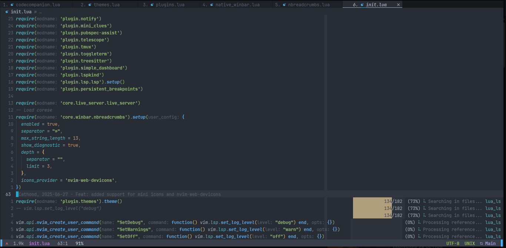

# My Neovim configs



```dart
// here should be nvim binary installation 
export PATH="$PATH":"/opt/nvim/bin"
// and you need to have these libraries installed already
// to avoid issues with the clipboard and more
sudo apt-get updated && sudo apt install xclip git make cmake gcc g++ yarn clang pkg-config ninja-build fzf ripgrep fd-find luarocks
```

## Instructions to configure AI

**Gemini:** [gemini-cli](https://github.com/google-gemini/gemini-cli/blob/main/docs/get-started/authentication.md#persisting-environment-variables)
**Copilot:** call `:Copilot setup` in Neovim to generate api token
 
For running Desktop enviroment

```dart
// set path for clang
which clang++
// and, with the path printed
export CXX=/path/to/clang++
```

For running Desktop that requires GTK3
```dart
// if you have issues with gtk3,
// just run
sudo apt install libgtk-3-dev
```

## Language requirements

## Manual installation

* Lua:
    ```dart
       // install ninja
       python3 -m pip install ninja
       // go to development folder and run
       git clone https://github.com/LuaLS/lua-language-server
       cd lua-language-server
       // and run this 
       ./make.sh
       // create a symbolic link to usr 
       sudo ln -s ~/development/lua-language-server/bin/lua-language-server /usr/local/bin/lua-language-server
       // then just export the binary file
       export PATH="$PATH":"$HOME/development/lua-language-server/bin/lua-language-server"
    ```
* Docker:
    ```dart
        npm install -g dockerfile-language-server-nodejs
        npm install -g @microsoft/compose-language-service
        go install github.com/docker/docker-language-server/cmd/docker-language-server@latest
        // for yaml
        npm install -g yaml-language-server
    ```
* Json, HTML, CSS:
    ```dart
        // run this
        npm i -g vscode-langservers-extracted
        // Language server for autocompletion and go-to-definition functionality for CSS modules.
        // and CSS variables autocompletion and go-to-definition
        sudo npm install -g cssmodules-language-server css-variables-language-server
        // for tailwindcss support use this
        npm install -g tailwindcss-language-server
    ```
* Java:
    You need to that we use `jdtls` [docs](https://github.com/mfussenegger/nvim-jdtls?tab=readme-ov-file)

    1. `eclipse.jdt.ls` requires `Java 21`
    2. The `jdtls` script requires `Python 3.9`
    3. Install this using mason.nvim calling `MasonInstall jdtls java-test java-adapter-server`

    To avoid missing some configurations, [see the correct setup](https://lsp-zero.netlify.app/blog/setup-with-nvim-jdtls.html) 
    ```dart
      // Where should be installed Java:
      '/usr/lib/jvm/jdk-21'
      // You should have these variables in your .bashrc or .zshrc
      export JAVA_HOME="/usr/lib/jvm/jdk-21"
      export PATH="$PATH":"$JAVA_HOME/bin"
    ```
* Nginx
    ```dart
       pip install -U nginx-language-server
    ```
* Node and typescript
    ```dart
        // First at all install Nodejs and Npm
        // Visit, and follow the steps to install them
        // https://nodejs.org/en/download
        // then install typescript globaly
        sudo npm i -g typescript typescript-language-server
        sudo npm i -g tailwindcss-language-server
        sudo npm install -g prettier eslint
        // for astro
        // npm install -g @astrojs/language-server
        // vim.lsp.enable('astro')

        // At this point, just at these vars into your .bashrc or .zshrc
        export PATH="$PATH":"$HOME/.nvm/versions/node/v22.14.0/bin/typescript-language-server"
        export PATH="$PATH":"/usr/bin/npm"
    ```
* Golang
    ```dart
        // Visit: https://go.dev/doc/install
        //
        // To enable LSP commands
        // execute:
        sudo apt install gopls
        // so, after install gopls, go to your $HOME path
        // and execute this (get all the important stuff
        // of go that you need)

        go install golang.org/x/tools/gopls@latest
        // these servers allow the warnings, suggestion and imports
        go install github.com/nametake/golangci-lint-langserver@latest
        go install github.com/golangci/golangci-lint/cmd/golangci-lint@latest
        go install github.com/josharian/impl@latest
        // go to ~/go/bin
        // and copy all installed (golangci and gopls)
        // to usr/bin
        //
        // sudo cp gopls /usr/bin
        // sudo cp golangci-lint /usr/bin
        // sudo cp golangci-lint-langserver /usr/bin
        //
        //
        // and the docs
        go get -u github.com/zmb3/gogetdoc
        //
        // You probably, after the go installation 
        // will need to have these vars in your .bashrc or .zshrc
        export PATH="$PATH":"$HOME/go/bin"
        export PATH="$PATH":"/usr/local/go/bin"
    ```
* Clangd
    ```dart
        // see: https://clangd.llvm.org/installation
        //
        // for linux, we use
        //
        sudo apt-get install clangd-15
        //
        // This will install clangd as /usr/bin/clangd-15. Make it the default clangd:
        //
        sudo update-alternatives --install /usr/bin/clangd clangd /usr/bin/clangd-15 100
        sudo apt-get install clang-format cpplint

        // Put the path of the clangd into your .bashrc or .zshrc
        export PATH="$PATH":"/usr/bin/clangd-15"

    ```
* Python3
    ```dart
        // python3 or python3.12 or major
        // choose the version that you want
        //
        // at this point, i prefer python3
        npm i -g python3 //-g
        npm config set python3 /usr/bin/python3

        /// optional command
        /// be careful while using --break-system-packages option
        python3 -m pip install --user --upgrade --break-system-packages neovim   

        /// you should have installed python3
        /// and you need to have this var in your .bashrc or .zshrc
        export PATH="$PATH":"/usr/bin/python<version>"

    ```
* Flutter
    If you're facing issues with linux not recognizing your phone
    check these sites:
    1. [adb-device-list-doesnt-show-phone](https://askubuntu.com/questions/863587/adb-device-list-doesnt-show-phone)
    2. [android-adb-no-permissions-for-device](https://stackoverflow.com/questions/77925533/android-adb-no-permissions-for-device)
    3. [setup](https://docs.flutter.dev/platform-integration/linux/setup)
    4. [Android + Flutter plugin setup](https://github.com/flutter/flutter/issues/46878#issuecomment-566848200)
    ```dart
        // Run:
        sudo apt-get install adb android-tools-adb android-tools-fastboot
        // Using sudo, create this file: /etc/udev/rules.d/51-android.rules.
        //
        // Use this format to add each vendor to the file:
        //
        // `SUBSYSTEM=="usb", ATTR{idVendor}=="0bb4", MODE="0666", GROUP="plugdev"`
        //
        // sudo chmod a+r /etc/udev/rules.d/51-android.rules
        //
        // Then restart udev with sudo service udev restart or sudo /etc/init.d/udev restart

        // Where should be installed flutter:
        '~/development/flutter/bin/flutter'
        // You should have these variables in your .bashrc or .zshrc
        export PATH="$PATH":"$HOME/development/flutter/bin/"
        export PATH="$PATH":"$HOME/development/flutter/bin/cache/dart-sdk/bin/"
        export PATH="$PATH":"$HOME/.pub-cache/bin"
        // After Android studio installation
        // you should have these variables configured too
        export ANDROID_HOME="$HOME/Android/Sdk" 
        export PATH="$PATH":"$HOME/development/flutter/bin/"
        export PATH="$PATH":"$HOME/development/flutter/bin/cache/dart-sdk/bin/"
        export PATH="$PATH":"$HOME/Android/Sdk/platform-tools"
        export PATH="$PATH":"$HOME/Android/Sdk/tools"
        export PATH="$PATH":"$HOME/Android/ndk-build"
        export PATH="$PATH":"$HOME/Android/Sdk/"
        path+=${ZDOTDIR:-~}/.zsh_functions
    ```
* Rust (standard installation)
    ```dart
      // ensure that you have fontconfig-devel
      // installed on your linux distro
      // or install libfontconfig1-dev
      //
      rustup component add rustfmt clippy
      // then, add the rust-analyzer with rustup
      rustup component add rust-analyzer
    ```
